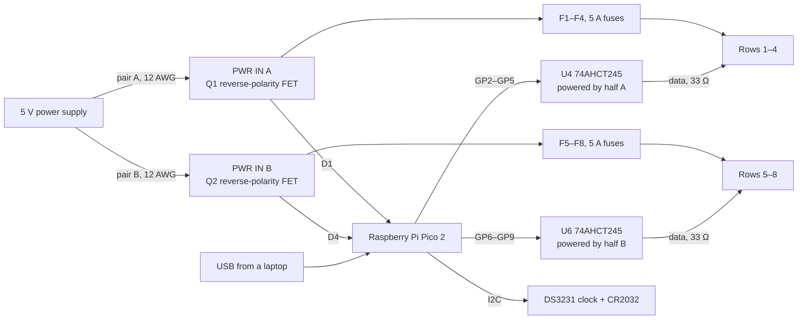

# FRC 75 marquee controller


A custom-made controller board for the scrolling LED marquee on top of FRC Team 75's pit. This is one 148 × 90 mm PCB that contains a Raspberry Pi Pico 2 to control all 8 rows of WS2812B LEDs (approx. 1,200 pixels), with its own fused 5 V feed for each row.

## What it is

The marquee consists of 8 rows of WS2812B strip, approximately 60 LEDs/m, attached to our pit truss. This board is bolted to the back of the sign and takes the place of the old box of parts which ran the sign. It:

- drives all 8 rows at the same time from a Raspberry Pi Pico 2
- takes 5 V from our existing power supply in two sections (rows 1–4 and 5–8) and puts a 5 A blade fuse in front of each row
- raises the 3.3 V data signals from the Pico to the 5 V that the LEDs require
- uses a DS3231 clock and CR2032 backup battery to keep time
- is protected against a power cable connected in reverse polarity

It is intentionally not connected to the internet or Bluetooth, so the board does not broadcast at events. The messages are changed via USB.

It is not an ordinary LED controller because of a couple of things. Each row is fused on the board, so a shorted strip will blow one 5 A fuse rather than cook a wire. Both halves are equipped with a MOSFET on the ground side, so a reversed cable is just a no-op. Each level shifter is powered by the same half as the rows it drives, so a row with no power will never receive a data signal pushed into it.

## Why I made it

We used to use an Arduino Mega for our marquee. Eight data wires came out of the Mega, through a hand-soldered perfboard with resistors, down a multicore cable to a DB9 connector, and then spread out to the strips. There were two terminal blocks on the back of the sign, the Mega had its own dedicated wall plug, and a lot of it was taped up.

I wanted one board that would bolt to the back of the sign, plug right into the strips, and would not burn if a row shorts or a cable is inserted backwards.

## How it works



The 5 V supply is connected with two sets of wires. Each half supplies 4 rows. The board is made with 1 oz copper, so the firmware limits each row to 3 A and each half to 4 A (see Design notes). The Pico gets its power through Schottky diodes (D1, D4) from either half, or from USB. This means it will keep running when either half or USB is plugged in, and it will not back-feed the LED supply when a laptop is plugged in.

The data lines are on GP2–GP9. They need to be eight pins in a row, as all eight strips are controlled by the same PIO hardware on the Pico.

### Pin map

| Row | Pico pin | Level shifter | Fuse | Terminal |
|---|---|---|---|---|
| 1 | GP2 | U4 | F1 | J4 |
| 2 | GP3 | U4 | F2 | J5 |
| 3 | GP4 | U4 | F3 | J6 |
| 4 | GP5 | U4 | F4 | J7 |
| 5 | GP6 | U6 | F5 | J8 |
| 6 | GP7 | U6 | F6 | J9 |
| 7 | GP8 | U6 | F7 | J10 |
| 8 | GP9 | U6 | F8 | J11 |

| Other | Pico pin |
|---|---|
| DS3231 SDA / SCL | GP20 / GP21 |
| Status LED (D3) | GP22 |
| Spare UART header J13 (TX / RX) | GP0 / GP1 |
| Reset button (SW2) | RUN |
| Power in | VSYS, through D1 / D4 |
| 3.3 V for the clock | 3V3 OUT |

Each row terminal (J4–J11) is pin 1 = 5 V, pin 2 = GND, pin 3 = DATA.

## Ordering and building the board

- PCB: upload `pcb/Gerber_PCB1_2026-10-03.zip` to JLCPCB as a 2-layer, 1.6 mm board with 1 oz copper. The firmware's current limits are set for 1 oz.
- Assembly: turn on PCB Assembly and upload `pcb/bom.csv` and the pick-and-place file exported from `pcb/PCB.epro2`. Every part has an LCSC number. The `Assembly` column says which parts JLC places; leave the "Hand solder" ones unselected.
- Pico 2: use a plain Pico 2 without headers. It solders flat to the board by its castellated edges, and its USB port sits in the notch on the right edge.
- By hand: solder the fuse holders, screw terminals, headers and power wires yourself.
- Fuses: 8 standard-size ATO/ATC 5 A blade fuses. The 3557-2 holders don't take mini fuses.

## Firmware

The firmware is in [`firmware/`](firmware). It runs on the Pico 2 (Arduino, using the arduino-pico core) and:

- drives all 8 rows at once on GP2–GP9 with the Adafruit NeoPXL8 library
- scrolls each line of `messages.txt`, which you edit by plugging the board into a computer, where it shows up as a USB drive
- fills in `{TIME}` and `{DATE}` from the DS3231 clock
- keeps each row under 3 A and each half under 4 A, so the 1 oz traces don't overheat
- blinks the status LED on GP22 so you can see it's running

[`firmware/README.md`](firmware/README.md) has the upload steps and settings. The firmware was written with AI. It compiles, but it hasn't been tested on the marquee yet.

## What's in this repo

```
README.md                  this file
bom.csv                    everything to buy, with links, prices and the total
pcb/
  PCB.epro2                EasyEDA Pro project (schematic + PCB)
  Gerber_PCB1_2026-10-03.zip
  bom.csv                  component list for ordering (LCSC numbers)
  3D_PCB1_2026-10-03.step  3D model of the assembled board
  DXF_Schematic1_2026-10-1.zip
firmware/
  README.md                how to upload and use it
  marquee/marquee.ino      Pico 2 sketch
```

## Bill of materials

This is what we're buying to build it. The full list with part numbers is in [`bom.csv`](bom.csv), and the board's component list is in [`pcb/bom.csv`](pcb/bom.csv).

| Item | Qty | Supplier | Cost (USD) |
|---|---|---|---|
| [PCB fabrication](https://cart.jlcpcb.com/quote) | 5 | JLCPCB | 10.00 (estimate) |
| [PCB assembly (PCBA) fees](https://cart.jlcpcb.com/quote) | 2 | JLCPCB | 25.00 (estimate) |
| [SMD components for PCBA](https://cart.jlcpcb.com/quote) | 2 | JLCPCB | 27.64 |
| [Raspberry Pi Pico 2](https://www.lcsc.com/product-detail/C41407547.html) | 1 | LCSC | 9.32 |
| [ATO fuse holder](https://www.lcsc.com/product-detail/C352820.html) | 8 | LCSC | 11.72 |
| [Row screw terminal](https://www.lcsc.com/product-detail/C474882.html) | 8 | LCSC | 1.12 |
| [3-pin header](https://www.lcsc.com/product-detail/C2937625.html) | 50 | LCSC | 1.00 |
| [4-pin header](https://www.lcsc.com/product-detail/C2691448.html) | 20 | LCSC | 0.55 |
| [ATO blade fuse 5 A](https://www.lcsc.com/product-detail/C142682.html) | 10 | LCSC | 1.19 |
| [CR2032 coin cell](https://www.amazon.com/s?k=CR2032+battery) | 1 | Amazon | 2.00 (estimate) |
| [M3 standoffs + screws](https://www.amazon.com/s?k=M3+brass+standoff+kit) | 1 | Amazon | 5.00 (estimate) |
| [12 AWG wire, red + black](https://www.amazon.com/s?k=12+AWG+silicone+wire+red+black) | 1 | Amazon | 10.00 (estimate) |
| [18 AWG wire](https://www.amazon.com/s?k=18+AWG+silicone+wire) | 1 | Amazon | 5.00 (estimate) |
| [Shipping](https://cart.jlcpcb.com/quote) | 1 | JLCPCB / LCSC | 30.00 (estimate) |
| [Taxes / tariffs](https://cart.jlcpcb.com/quote) | 1 | JLCPCB / LCSC | 20.00 (estimate) |
| **Total** | | | **159.54** |

The lines marked estimate get replaced with the real amounts from the JLCPCB and LCSC carts. The LED strips, 5 V power supply and strip connectors are reused from the old marquee, so they're in `bom.csv` at $0.

## Design notes

- Current limits: the board is 1 oz copper. With a 10 °C rise (IPC-2221), the 1.5 mm row traces carry about 3 A and each half's ~2 mm input traces about 4 A, so the firmware holds each row to 3 A and each half to 4 A. If a limit is reached, the whole sign dims evenly. Scrolling text normally draws well under this.
- Half B is held to 2 A for now: its input crosses between layers through single 0.3 mm vias. Adding 6–8 vias at those spots lets it go up to 4 A like half A.
- Fuses: 5 A fuses are located between each half's power and its row terminals. They protect against shorts, and the firmware's current limits control brightness.
- Reverse-polarity MOSFETs (PSMN1R0-30YLDX): they are on the ground side. They have about 1.3 mΩ of resistance and use about 0.02 W at 4 A, which is not enough to require heatsinks.
- Level shifters (SN74AHCT245): there's one per half, each powered by that half's 5 V. If a half is not powered, then its data lines are not powered either, which means the Pico can't accidentally power the strips through the data pins.
- Clock (DS3231): with no WiFi there's no internet time, so the board is equipped with a temperature-compensated clock with a coin-cell backup.
- Spare headers: J12 is for an SWD debugger. J13 is a UART header to allow adding something like a wireless module later without redoing the board.

## Credits

Designed by Pranet Godavarty. Schematic and PCB made in EasyEDA Pro.

AI use: the firmware was written with AI, and those hours aren't counted.
