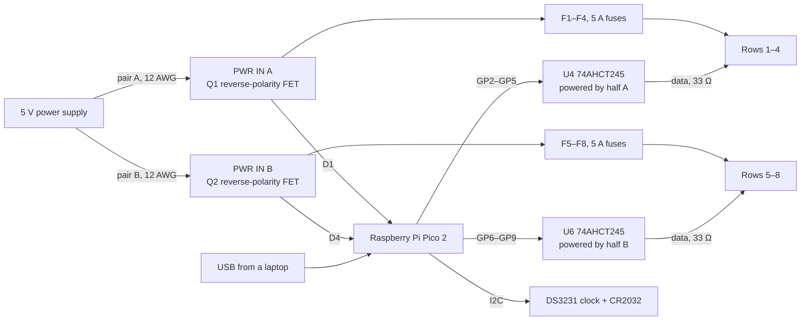

# FRC 75 marquee controller

A custom-made controller board for the scrolling LED marquee on top of FRC Team 75's pit. This is one 148 × 90 mm PCB that contains a Raspberry Pi Pico 2 to control all 8 rows of WS2812B LEDs (approx. 1,200 pixels), with its own fused 5 V feed for each row.

## What it is

The marquee consists of 8 rows of WS2812B strip, approximately 60 LEDs/m, attached to our pit truss. This board is bolted to the back of the sign and takes the place of the old box of parts which ran the sign. It:

- drives all 8 rows at the same time from a Raspberry Pi Pico 2
- takes 5 V from our existing power supply in two sections (rows 1–4 and 5–8) and puts a 5 A blade fuse in front of each row
- raises the 3.3 V data signals from the Pico to the 5 V that the LEDs require
- uses a DS3231 clock and CR2032 backup battery to keep time
- is protected against a power cable connected in reverse polarity

It is intentionally not connected to the internet or Bluetooth, so the board does not broadcast at events. The messages are changed via USB.

It is not an ordinary LED controller because of a couple of things. Each row is fused on the board, so a shorted strip will blow one 5 A fuse rather than cook a wire. Both halves are equipped with a MOSFET on the ground side, so a reversed cable is just a no-op. Each level shifter is powered by the same half as the rows it drives, so a row with no power will never receive a data signal pushed into it.

## Why I made it

We used to use an Arduino Mega for our marquee. Eight data wires came out of the Mega, through a hand-soldered perfboard with resistors, down a multicore cable to a DB9 connector, and then spread out to the strips. There were two terminal blocks on the back of the sign, the Mega had its own dedicated wall plug, and a lot of it was taped up.

I wanted one board that would bolt to the back of the sign, plug right into the strips, and would not burn if a row shorts or a cable is inserted backwards.

## How it works



The 5 V supply is connected with two sets of wires. Each half supplies 4 rows, and with the firmware's limit of 3 A per row, each half is limited to 12 A. The Pico gets its power through Schottky diodes (D1, D4) from either half, or from USB. This means it will keep running when either half or USB is plugged in, and it will not back-feed the LED supply when a laptop is plugged in.

The data lines are on GP2–GP9. They need to be eight pins in a row, as all eight strips are controlled by the same PIO hardware on the Pico.

### Pin map

| Row | Pico pin | Level shifter | Fuse | Terminal |
|---|---|---|---|---|
| 1 | GP2 | U4 | F1 | J4 |
| 2 | GP3 | U4 | F2 | J5 |
| 3 | GP4 | U4 | F3 | J6 |
| 4 | GP5 | U4 | F4 | J7 |
| 5 | GP6 | U6 | F5 | J8 |
| 6 | GP7 | U6 | F6 | J9 |
| 7 | GP8 | U6 | F7 | J10 |
| 8 | GP9 | U6 | F8 | J11 |

| Other | Pico pin |
|---|---|
| DS3231 SDA / SCL | GP20 / GP21 |
| Status LED (D3) | GP22 |
| Spare UART header J13 (TX / RX) | GP0 / GP1 |
| Reset button (SW2) | RUN |
| Power in | VSYS, through D1 / D4 |
| 3.3 V for the clock | 3V3 OUT |

Each row terminal (J4–J11) is pin 1 = 5 V, pin 2 = GND, pin 3 = DATA.

## Ordering and building the board

- PCB: upload `pcb/gerbers.zip` to JLCPCB as a 2-layer, 1.6 mm board with 2 oz copper. The power traces carry up to 12 A per half, so don't drop to 1 oz.
- Small parts: order JLC assembly using `pcb/bom.xlsx` and `pcb/cpl.csv`. Every part has an LCSC number.
- Pico 2: use a plain Pico 2 without headers. It solders flat to the board by its castellated edges, and its USB port sits in the notch on the right edge.
- By hand: solder the fuse holders, screw terminals, headers and power wires yourself.

## What's in this repo

```
README.md     this file
bom.csv       every part with links, prices and the total cost
pcb/          gerbers.zip, schematic, and BOM
```

The full CAD assembly is in Onshape: TODO add your Onshape link.

## Bill of materials

Everything you need, including parts we already owned, is in [`bom.csv`](bom.csv), with links and prices.

Total cost: ~$67.54

## Design notes

- Two power halves: with 4 rows at 3 A each, the maximum for each half is 12 A, which is reasonable for the input wires and traces.
- Fuses: 5 A fuses are located between each half's power and its row terminals. They protect against shorts, and the firmware's 3 A cap controls brightness.
- Reverse-polarity MOSFETs (PSMN1R0-30YLDX): they are on the ground side. They have about 1.3 mΩ of resistance and use about 0.2 W at 12 A, which is not enough to require heatsinks.
- Level shifters (SN74AHCT245): there's one per half, each powered by that half's 5 V. If a half is not powered, then its data lines are not powered either, which means the Pico can't accidentally power the strips through the data pins.
- Clock (DS3231): with no WiFi there's no internet time, so the board is equipped with a temperature-compensated clock with a coin-cell backup.
- Spare headers: J12 is for an SWD debugger. J13 is a UART header to allow adding something like a wireless module later without redoing the board.

## Credits

Designed by Pranet Godavarty.

I used Easyeda for the schematics and PCB design
